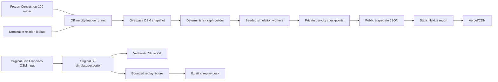
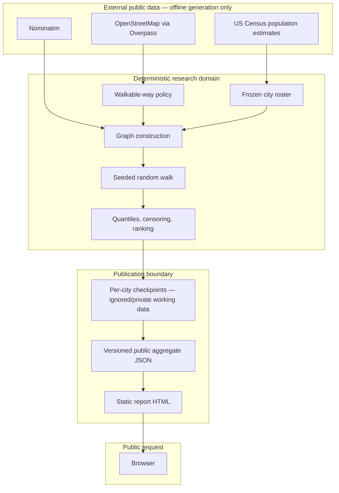
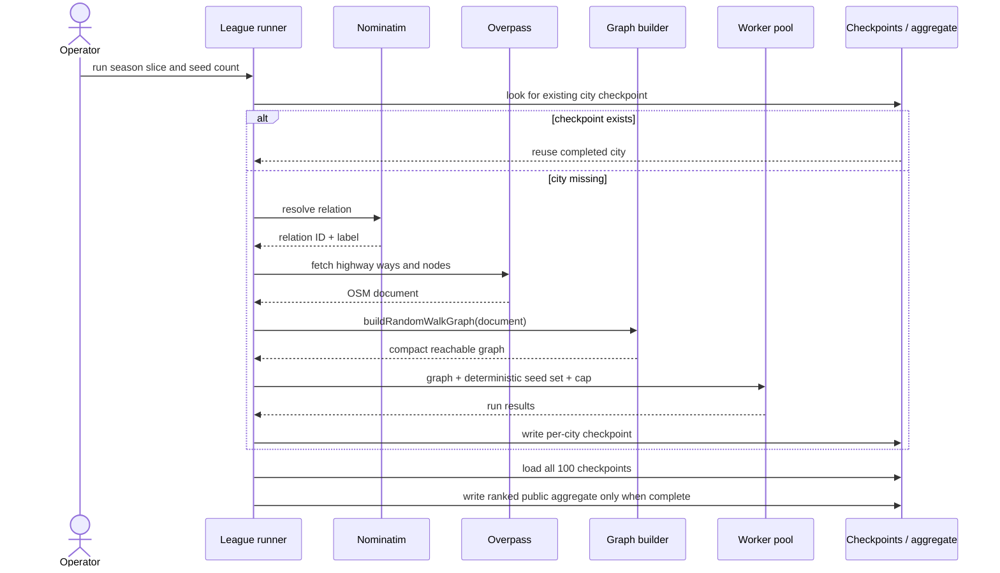
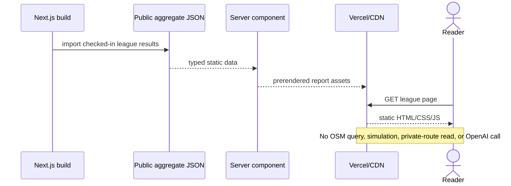
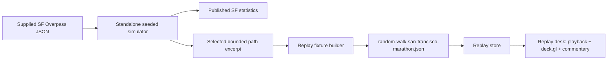

# Random-walk simulation architecture and code flow

**Audience:** agents changing, reproducing, or publishing Walking Ocho random-walk research

**Status:** current production architecture, August 2026

**Scope:** the deterministic random-walk simulator, the Hundred-City League batch, and the San Francisco replay excerpt

## The short mental model

The simulator is an offline research pipeline, not a browser feature and not an AI system.

It turns OpenStreetMap ways into an undirected graph of walkable street segments. A seeded walker starts at a reachable intersection and chooses uniformly among the segments connected to its current intersection. It has no destination, memory, route plan, or preference for new streets. A run succeeds only after it traverses every segment in the selected reachable component at least once.

The public website reads already-generated JSON. Opening a report or replay does not contact OpenStreetMap, run a simulation, or generate commentary.



## Two versioned products use the idea

Do not merge these result sets implicitly.

| Product | Purpose | Simulation source | Public output |
| --- | --- | --- | --- |
| Original San Francisco experiment | Long-form proof of the random-walk premise plus a watchable excerpt | The earlier standalone CLI and its preliminary SF graph | SF research article and a marathon-length replay fixture |
| Hundred-City League | Repeat the same coverage experiment across a frozen roster of 100 US cities and rank the results | Shared compact graph/simulation core plus offline batch workers | Static league aggregate and league report |

The original SF graph had 4,922 reachable segments. A later league-season SF graph is much larger because the boundary/source snapshot and graph acquisition differ. The original source snapshot is not available in the repository. Treat the published SF figures as a versioned historical experiment, not as a row that can be regenerated from the current league machinery.

The proposed **Dumb Gains game** is a separate product. It may eventually vary walker memory or decision policy, but those mechanics must not silently alter the baseline uniform random-walk research contract.

## System boundaries



### Ownership by module

| Concern | Current owner | Must remain independent of |
| --- | --- | --- |
| Frozen 100-city membership | `src/lib/research/hundred-city-roster.ts` | simulation difficulty and page presentation |
| OSM filtering and graph truth | `src/lib/research/random-walk-simulator.ts` | React, deck.gl, commentary, and Vercel |
| Seeded walk and summary metrics | `src/lib/research/random-walk-simulator.ts` | network calls and UI state |
| Network acquisition, retries, checkpoints, parallelism, ranking | `scripts/run-hundred-city-league.ts` | public request handling |
| Original SF experiment and replay export | `scripts/simulate-random-walk.ts` | current league ranking |
| League publication | `data/research/hundred-city-league.json` and `src/app/research/hundred-city-league/page.tsx` | live APIs and model calls |
| Replay presentation | normal replay fixture/store/UI pipeline | simulation execution |

## City-league code flow

### 1. Select the roster

`HUNDRED_CITY_ROSTER` is a frozen Census Vintage 2025 top-100 list of incorporated places. Population rank selects league membership; it is not a difficulty input.

Each roster entry contains:

```ts
type LeagueCity = {
  populationRank: number;
  name: string;
  state: string;
  population2025: number;
};
```

Changing the roster changes the meaning of the season and requires a new documented dataset/version.

### 2. Resolve the administrative boundary

For each city, the batch runner asks Nominatim for an OpenStreetMap relation. A small alias table handles known naming differences such as Urban Honolulu/Honolulu and Boise/Boise City. The selected relation ID is converted to an Overpass area ID.

This is an auditable data-acquisition choice, not a simulation choice. A wrong relation can produce a perfectly deterministic answer for the wrong geography, so each checkpoint records the selected boundary ID and display name.

### 3. Fetch an OSM snapshot

The runner requests all highway-tagged ways and their nodes within the selected area. It retries transient responses across several public Overpass endpoints.

Network access ends here. The resulting `OsmDocument` is passed to the domain layer:

```ts
type OsmDocument = {
  osm3s?: { timestamp_osm_base?: string };
  elements: Array<OsmNode | OsmWay>;
};
```

### 4. Convert OSM geometry into the decision graph

```mermaid
flowchart LR
    Doc["OSM nodes + ways"] --> Filter["Filter walkable ways"]
    Filter --> Edges["Adjacent-node raw edges"]
    Edges --> Incidence["Build node incidence"]
    Incidence --> Junctions["Decision nodes: degree != 2"]
    Junctions --> Collapse["Collapse degree-2 chains"]
    Collapse --> Component["Select largest connected component"]
    Component --> Compact["Compact indices + typed arrays"]
```



The filter currently:

- requires a `highway` tag;
- rejects `area=yes`;
- rejects motorway, trunk, raceway, construction, proposed, abandoned, and elevator ways;
- rejects `access=no`, `access=private`, `foot=no`, and `foot=private`;
- rejects every bridge-tagged way.

Rejecting all bridges is deliberately conservative. It prevents water crossings, produces an HPI (Hydro-Pedestrian Incident) count of zero by construction, and may also exclude legitimate dry-land overpasses. Change this only as a new explicit graph-policy version.

Every pair of adjacent OSM nodes on an accepted way becomes a raw undirected edge with a haversine length. Nodes with degree two do not represent decisions, so chains through them are collapsed into one segment between decision nodes. Cul-de-sac ends remain decisions because their degree is not two. Only the largest connected component is simulated.

The resulting graph uses compact arrays so workers do not allocate thousands of objects on every step:

```ts
type RandomWalkGraph = {
  starts: number[];
  offsets: Uint32Array;
  adjacentSegments: Uint32Array;
  segmentA: Uint32Array;
  segmentB: Uint32Array;
  segmentMeters: Float64Array;
  sourceTimestamp: string | null;
  statistics: {
    osmWaysAccepted: number;
    rawEdges: number;
    collapsedSegments: number;
    reachableJunctions: number;
    reachableSegments: number;
    streetKilometers: number;
  };
};
```

`offsets` and `adjacentSegments` form a CSR-style adjacency index. The segments adjacent to node `n` occupy:

```ts
adjacentSegments.slice(offsets[n], offsets[n + 1])
```

### 5. Run one seeded walker

The algorithm is intentionally stupid:

```text
rng = mulberry32(seed)
node = uniformly random eligible start node
visited = one bit/byte per segment

until every segment has been visited or the traversal cap is reached:
    choices = every segment incident to node
    segment = uniformly random member of choices
    node = the other endpoint of segment
    add segment length to total distance
    if segment was already visited:
        increment revisit count
    else:
        mark segment visited

report completed, coverage share, distance, traversals, and revisits
```

Immediate backtracking is allowed. The walker has no memory, does not favor unvisited segments, and does not know where the boundary or finish is. Uniformity is over connected collapsed segments at the current decision node.

A result includes:

```ts
type RandomWalkResult = {
  seed: number;
  traversals: number;
  distanceKilometers: number;
  revisitTraversals: number;
  revisitShare: number;
  coverageMultiple: number;
  nominalEightHourWalkingDays: number;
  completed: boolean;
  coverageShare: number;
};
```

`coverageMultiple` compares traveled distance with unique street-segment mileage. It explains why coverage costs far more than simply summing street mileage: the walker repeatedly revisits connectors, exits cul-de-sacs along the same route, re-enters neighborhoods through bottlenecks, and spends enormous time waiting to randomly select the few still-unvisited segments. Hills affect the story and real effort, but the baseline transition probability is not grade-weighted.

### 6. Parallelize, cap, and checkpoint



Seeds are derived from population rank and run index, so rerunning the same graph with the same parameters is deterministic. Worker threads make the batch faster; they must not change the result.

A run is capped at:

```text
reachable segment count × traversal-cap multiple
```

Hitting the cap is **right-censoring**, not failure to collect a result. The output preserves `completed=false` and the achieved `coverageShare`. A censored metric is displayed with `≥` where appropriate; code must never pretend the walker finished or extrapolate an exact finish.

Per-city checkpoints make the expensive, failure-prone network batch resumable. They live under `private-imports/hundred-city-league/` and are not public artifacts. The aggregate is written only after all 100 city checkpoint files exist.

### 7. Summarize and rank

Completed and censored runs are summarized into fast, typical, slow, and unusually slow quantiles (P10, median, P90, P99), completion rate, revisit behavior, and coverage multiple.

Current league difficulty ordering is:

1. lower completion rate first;
2. then higher median coverage multiple.

This makes censoring visible instead of incorrectly ranking a capped distance as a completed distance. Any change to this ordering is a methodology change and should create a new documented season rather than silently rewriting the current table.

### 8. Publish static data



The league page derives headings and jokes only from stored results. For example, it may joke about a zero-finish city or the observed revisit share, but it must not invent a metric, a finish, or a geographic fact.

## Original San Francisco replay flow

The earlier `scripts/simulate-random-walk.ts` is a predecessor to the shared league core. It retains richer node-by-node path geometry because it can export a bounded route replay, while the league graph is optimized for aggregate simulations.



The replay fixture is ordinary stored replay data after export. Playback progress, map layers, elevation presentation, and commentary display use the same application contracts as other public replays. Replaying it never resumes the random-walk simulation.

There is intentional historical duplication between the original CLI and the generalized core. If consolidating them, preserve both:

- the current league's deterministic graph and metrics contract; and
- the richer traversed geometry required to export a replay.

Do not recompute or overwrite the original published SF statistics unless the work is explicitly a new versioned experiment.

## Truth and safety invariants

An agent modifying this system should preserve all of these unless the user approves a new methodology:

1. **Determinism:** a fixed OSM document, policy, seed, and cap produce the same result.
2. **Uniform choice:** each connected collapsed segment at a decision node has equal probability.
3. **No route planning:** no destination, frontier search, preference for novelty, or hidden heuristic.
4. **Explicit coverage:** completion means every reachable segment in the chosen component was traversed at least once.
5. **Explicit censoring:** capped runs remain incomplete and carry their achieved coverage.
6. **No water crossing in the current season:** bridge-tagged ways are excluded; HPI is zero by construction.
7. **One graph truth boundary:** filtering, distance, reachability, and simulation facts live outside React.
8. **Stored publication:** public reads consume checked-in results and fixtures; they do not regenerate them.
9. **No invented commentary facts:** jokes may interpret stored metrics but cannot create route or simulation facts.
10. **No model dependency:** the simulation, league report, and public replay work without OpenAI credentials.
11. **No private-route dependency:** the league is based on public Census/OSM data, not the user's personal walks.

## Failure and recovery behavior

| Failure | Expected behavior | Unsafe shortcut |
| --- | --- | --- |
| Nominatim selects an ambiguous boundary | Inspect the recorded relation and add a documented alias/selection fix | Tune results until city size looks plausible |
| Overpass is rate-limited or unavailable | Retry/back off, switch configured endpoint, and resume checkpoints | Move network fetching into the public page |
| One city takes too long | Preserve the cap and censoring state | Report the cap as a finish |
| Batch stops after 63 cities | Resume from checkpoint 64 | Delete valid checkpoints without reason |
| OSM changes later | Treat the new snapshot as a new reproducible season | Silently replace published results |
| Original SF cannot be regenerated | Preserve the documented version and fixture | Substitute a new graph under the old headline |
| Worker and core results diverge | Stop publication and restore parity | Average the two implementations |

## Change map for the next agent

| If changing… | Start in… | Required follow-through |
| --- | --- | --- |
| walkability or bridge policy | `src/lib/research/random-walk-simulator.ts` | add synthetic filter/graph tests; version the methodology; regenerate a new season |
| walker decision policy | `simulateRandomWalk` in the core | keep baseline intact or name a new product/mode; add deterministic tests |
| quantiles/result contract | `summarizeRandomWalks` | tests, aggregate schema review, page rendering review |
| city membership | `hundred-city-roster.ts` | cite/freeze a new source and create a new season |
| boundary resolution/retries/checkpoints | `run-hundred-city-league.ts` | test a small city slice; inspect relation IDs before a full run |
| difficulty ranking | league runner aggregate step | document the new ordering and censoring semantics |
| league copy/layout | league page and global CSS | use only stored facts; verify desktop and mobile |
| SF replay generation | `simulate-random-walk.ts` | preserve historical report; validate the resulting replay contract |

## Reproduction commands

Run the deterministic unit tests:

```bash
npm test -- src/lib/research/random-walk-simulator.test.ts
```

Run a small resumable league slice before attempting a season:

```bash
npm run simulate:city-league -- --runs=2 --traversal-cap=250 --from=1 --to=3
```

The production preseason used 10 seeds per city and a 250-traversal-per-segment cap:

```bash
npm run simulate:city-league -- --runs=10 --traversal-cap=250 --from=1 --to=100
```

This command performs public network requests and writes checkpoints/results. It requires explicit authorization before transmitting or publishing data, even though its inputs are public. Do not overwrite an existing season casually.

Before handing off a code change, run the relevant tests plus:

```bash
npm run typecheck
npm run lint
npm run build
git diff --check
```

## Known debt and deliberate limitations

- The first league season uses 10 seeds per city. That is a preseason-quality comparison, not a precise estimate of a heavy-tailed cover-time distribution. More seeds should be published as a new season.
- The original SF CLI and the worker-side league loop duplicate parts of the core algorithm. Consolidation would reduce parity risk, but must retain replay geometry and deterministic output.
- The core and worker calculate `revisitTraversals` as traversals minus the graph's total segment count. That is exact for completed runs, but it understates revisits for censored runs; a future schema version should use traversals minus actually visited segments and regenerate affected aggregate fields rather than patching presentation copy.
- Administrative-boundary selection remains a data-quality risk. Relation IDs are recorded so errors can be audited.
- The graph measures street-segment traversal, not sidewalk quality, legal crossing detail, walking effort, or time-varying access.
- Rejecting every bridge is a simple water-safety rule, not a complete land/water classifier.
- Nominal eight-hour days are a presentation conversion, not a claim about an actual person's pace or endurance.

## Canonical files

- `src/lib/research/random-walk-simulator.ts` — graph and simulation truth
- `src/lib/research/random-walk-simulator.test.ts` — synthetic contract tests
- `src/lib/research/hundred-city-roster.ts` — frozen league membership
- `scripts/run-hundred-city-league.ts` — offline multi-city orchestration
- `scripts/simulate-random-walk.ts` — original SF experiment/replay exporter
- `data/research/hundred-city-league.json` — current public league aggregate
- `data/replays/random-walk-san-francisco-marathon.json` — stored SF replay excerpt
- `src/app/research/hundred-city-league/page.tsx` — static league publication
- `src/app/research/random-walk-san-francisco/page.tsx` — original SF report
- `docs/HUNDRED_CITY_LEAGUE.md` — league methodology/results
- `docs/RANDOM_WALK_SAN_FRANCISCO.md` — original SF methodology/results

When those files disagree, stop and reconcile the deterministic core, stored data, and published methodology. Do not resolve a truth conflict only in presentation code.
